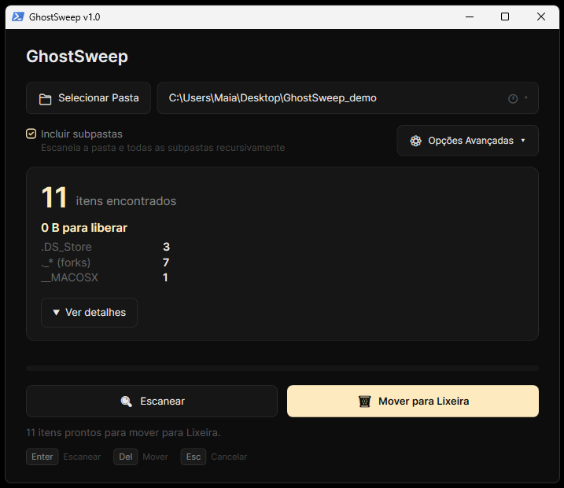
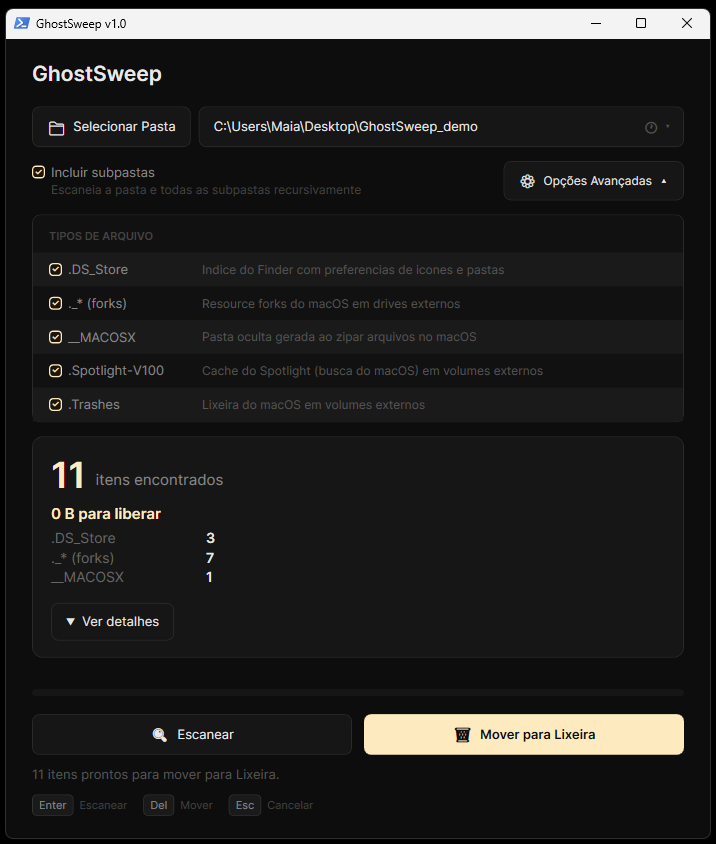
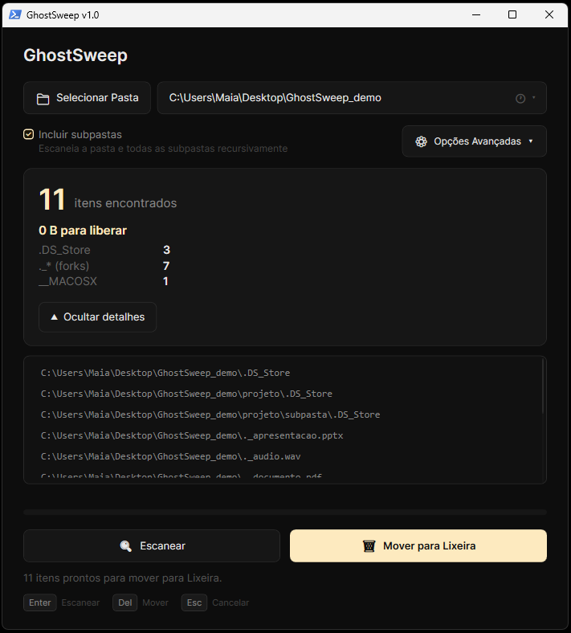
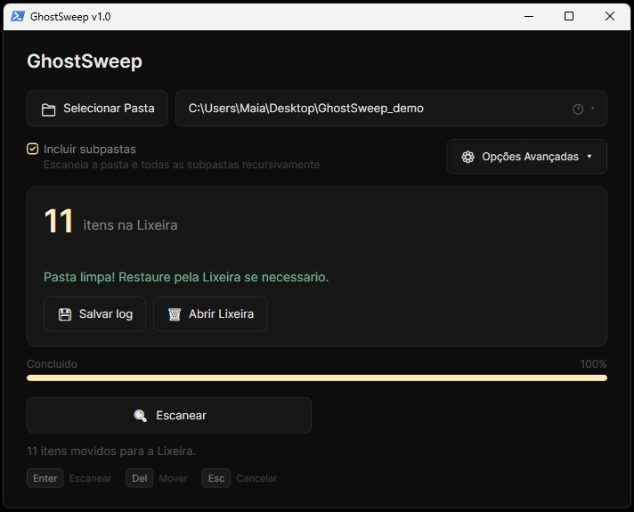

<p align="center">
  
</p>

<p align="center">
  <a href="LICENSE"></a>
  
  
  
  
</p>

<p align="center">
  <strong>Remove macOS ghost files from any Windows folder — no installs, no dependencies, no admin rights.</strong><br/>
  <code>.DS_Store</code> · <code>._*</code> resource forks · <code>__MACOSX</code> · <code>.Spotlight-V100</code> · <code>.Trashes</code>
</p>

---

## Why this exists

If you work with macOS files on Windows — shared drives, external hard drives, Google Drive, ZIP archives from a Mac — you've seen the ghost: invisible metadata files that macOS leaves behind everywhere. On Windows they show up as broken files, pollute search results, and confuse collaborators.

GhostSweep is a single PowerShell script that opens a GUI window, scans for those files, and removes them cleanly — sending everything to the Recycle Bin so nothing is lost by accident.

---

## Highlights

- **Zero dependencies** — pure PowerShell + WPF. Ships as one `.ps1` file. Runs on any Windows without installing anything.
- **Safe by default** — deleted files go to the Recycle Bin. Undo anytime with Ctrl+Z in Explorer.
- **Granular control** — enable or disable each file type before scanning. Run only what you need.
- **Keyboard-first** — full workflow without touching the mouse. Scan → review → delete → done.
- **Folder history** — remembers your last 5 folders, persisted across sessions.
- **Audit trail** — export a timestamped log with breakdown by type and full path list.
- **Adaptive UI** — window scales to your screen resolution. Works from 1280px up to 4K.

---

## Screenshots

<p align="center">
  
  
</p>
<p align="center">
  
  
</p>

---

## Installation

**Option 1 — One-liner** (no download required):

```powershell
irm "https://raw.githubusercontent.com/bguimaia/ghostsweep/main/ghostsweep.ps1" | iex
```

Open PowerShell, paste, press Enter. The window opens immediately.

**Option 2 — Download and run:**

1. Download `ghostsweep.ps1` and `GhostSweep.bat` to the same folder
2. Double-click `GhostSweep.bat`

---

## Usage

1. **Choose a folder** — click *Select Folder*, drag a folder onto the window, type a path directly in the field and press Enter, or click the history button (🕐) to pick a recent folder.
2. **Configure** — toggle *Include subfolders* (on by default). Open *Advanced Options* to enable/disable specific file types.
3. **Scan** — click *Scan* or press `Enter`. Results appear with a count per type.
4. **Review** — click *Show details* to expand a scrollable list of every found path.
5. **Move to Recycle Bin** — click *Move to Recycle Bin* or press `Del`. A progress bar tracks deletion in real time.
6. **Save the log** — after deletion, click *Save Log* to export a `.txt` audit file.

---

## Keyboard Shortcuts

| Key     | Action                                      |
| ------- | ------------------------------------------- |
| `Enter` | Start scan (or re-scan after deletion)      |
| `Del`   | Delete all found items (after a scan)       |
| `Esc`   | Cancel running scan or deletion             |

---

## Advanced Options

Click *Advanced Options* to expand the type filter panel. Each file type can be enabled or disabled independently:

| Option              | Default | What it does                                         |
| ------------------- | ------- | ---------------------------------------------------- |
| `.DS_Store`         | ✅ On   | macOS folder metadata files                          |
| `._* (forks)`       | ✅ On   | Resource fork files (prefixed with `._`)             |
| `__MACOSX`          | ✅ On   | Ghost folder left by macOS zip extraction            |
| `.Spotlight-V100`   | ✅ On   | Spotlight search index on external drives            |
| `.Trashes`          | ✅ On   | macOS trash folder on external drives                |
| Include subfolders  | ✅ On   | Recursively scan all nested folders                  |

---

## What it removes

| File / Folder       | Description                                                        |
| ------------------- | ------------------------------------------------------------------ |
| `.DS_Store`         | macOS folder metadata — invisible on Mac, junk on Windows          |
| `._FILENAME`        | Resource forks — appear as corrupted or duplicate files on Windows |
| `__MACOSX/`         | Ghost folder created when extracting macOS ZIP archives on Windows |
| `.Spotlight-V100`   | Spotlight index — leftover on external drives formatted on macOS   |
| `.Trashes`          | macOS trash folder on external drives                              |

---

## Log File

After a deletion, click *Save Log* to export a `.txt` file. The filename includes the timestamp of when the deletion started (e.g. `ghostsweep-2025-06-14_09-32-11.txt`).

Log format:

```
GhostSweep v1.0 — Log de limpeza
============================================================
Inicio:  14/06/2025 09:32:11
Fim:     14/06/2025 09:32:14
Pasta:   C:\Volumes\Drive\Project
Total:   48 itens  (1.2 MB)

RESUMO POR TIPO:
  .DS_Store:        34
  ._* (forks):      12
  __MACOSX:          2

ITENS MOVIDOS PARA A LIXEIRA:
------------------------------------------------------------
MODIFICADO EM          ARQUIVO
------------------------------------------------------------
14/06/2025 09:32:11    C:\Volumes\Drive\Project\.DS_Store
14/06/2025 09:32:11    C:\Volumes\Drive\Project\Assets\.DS_Store
...
```

---

## Requirements

- Windows 8.1 or later
- Windows PowerShell 5.1+ **or** PowerShell 7+
- No admin rights required

---

## Contributing

Contributions are welcome. Feel free to open issues, suggest features, or submit pull requests.
